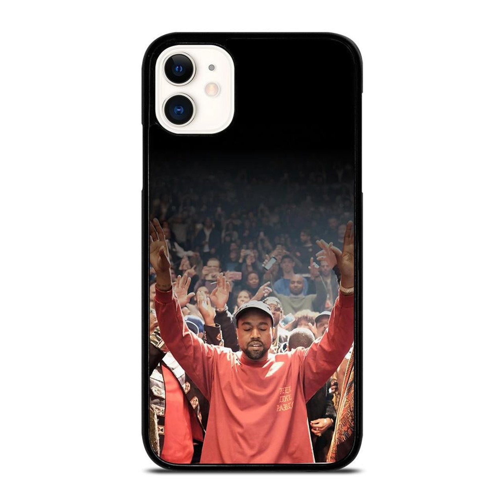

1. About Me Page
The "About Me" page introduces the band members and includes links to various social media profiles, allowing users to connect and follow on different platforms.

2. Home Page
The homepage features a login function for users to access their accounts and a slideshow to display featured content, engaging visitors with dynamic visuals and easy access to essential functions.

3. Merch Page
The "Merch" page displays products available for purchase which goes to the cart page after it is clicked to purchase

4. Ticket Selling Page
The ticket selling page offers users the ability to browse available tickets for events, and it goes to the cart page after purchasing tickets.There is a search bar and you can choose the seating and choose the quantity.

5. Cart Page
The cart page displays a summary of the user’s selected items, including merchandise and tickets, allowing users to get a tally of their price before proceeding to checkout. It also includes the option to clear the cart.

Technology used:

HTML (HyperText Markup Language)
HTML is the main building block of the website. It structures the content on each page, like headers, paragraphs, links, images, and forms.

CSS (Cascading Style Sheets)
CSS is used to style the website. It controls things like layout, colors, fonts, and how the site adapts to different screen sizes, making the website look good on both desktop and mobile.

JavaScript (JS)
JavaScript adds interactivity to the website, like handling the login function, making the slideshow work, validating form data, and creating other dynamic features that make the site more engaging for users.

CSS Media Queries
Media queries are part of CSS and are used to make the website responsive. They adjust how the site looks depending on the screen size, so it works well on both phones and computers.

Forms (HTML Forms + JavaScript)
Forms are used for collecting user input, like the login form. HTML is used to create the structure of the form, and JavaScript is used to check that the form is filled out correctly before it’s submitted.

Links
Links in HTML (using <a> tags) let users navigate the website. They connect different pages, such as from the merchandise page to the cart page or from the "About Me" page to social media profiles.

Images (HTML  Tags)
Images are used to show pictures, like product images or event promotions. The  tag in HTML allows us to add images and style them to fit the page layout.

Flexbox and Grid Layout (CSS)
Flexbox and Grid are CSS tools used for creating flexible layouts. Flexbox helps with positioning items (like the header or navigation), while Grid is used to arrange products on the merch page in a neat and responsive way.

JavaScript Functions
JavaScript functions are used to make the website more dynamic. For example, they handle the login process, toggle the cart display, and allow users to add items to their cart.

CSS Transitions
CSS transitions create smooth effects on the website, like making the product boxes grow when hovered over. This makes the site feel more interactive and visually interesting.

External Fonts (e.g., 'Bebas Neue')
External fonts like 'Bebas Neue' are used to improve the look of the website. They help give the site a unique style and match its branding.

Credits

Media 

Acknowledgements
I received inspiration for this project from Metallica and Imagine Dragons

User Audience, Intent, and Purpose
The website is designed for fans and customers interested in purchasing merchandise and Tickets. The primary audience includes music lovers, concertgoers, and fans of the band, who are looking for a streamlined way to access products, stay connected with the band’s latest events, and make purchases conveniently.

The website caters to:

Fans of the band Kanye West who want to stay updated with the latest merch and events.
People interested in purchasing band-related merchandise like clothing, accessories, and other memorabilia.
Concertgoers looking for a simple way to buy tickets for upcoming events.
Users looking for an easy and enjoyable shopping experience, from browsing products to completing their purchases.
The value it provides to users:

Convenience: Users can easily browse and purchase merchandise and tickets from one platform, saving time and effort.
Engagement: Links to social media profiles and interactive features allow users to stay connected with the band Kanye West and other fans.
